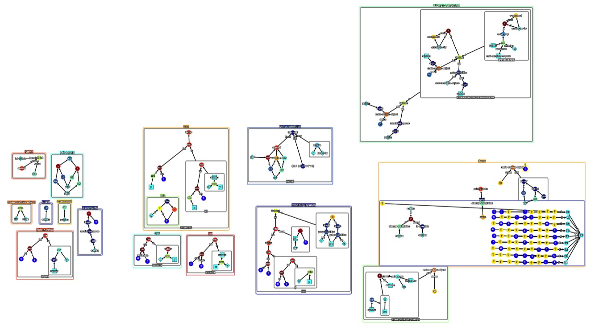

# Vambda

This picture solves a Sudoku.



No really, it does!


## Write beautiful programs with graphs.

Vambda is a visual editor for writing lisp programs, with an emphasis on beauty and visualizing logical structures. You can build and run programs completely in the browser (only tested in Chrome), no installation required.


## Quickstart

To start the server:

```
npm install (to install local dependencies)
node_modules/.bin/webpack-dev-server
```

Then visit http://localhost:8080/.

##  How To Play

See [here](./docs/docs.md) for a tutorial, or load a demo from the `./demos` folder.

Questions, comments, requests? Please send me a message or submit an issue!

## Things That Are Broken 

I don't actively maintain this -- it served its purpose as interesting experimentation, 
and if I want to come back to it it'll probably require a rewrite in a proper front-end framework!
Some things I know are broken.
* Comments' locations don't match up to the canvas. 

## A Closer look

Code is visual:


Functions are clear:


Algorithms are beautiful:


Output is correct:


(even for this difficult sparse Sudoku puzzle!)