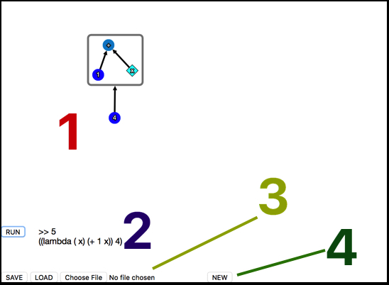

# Vambda Docs

This documentation is written for people who have some experience with programming. Vambda is very much based on Lisp. It should be familiar to anyone who's programmed in Lisp before, or used functional programming in general.

## Basic Layout

1. Canvas area: where programs are designed and drawn.
2. Program results: click 'run' to run the program on the canvas. The result will be printed (prefaced by '>>'), along with the program compiled to Scheme.
3. Save, load: click 'save' to download the current program as a .txt file to your computer. Click 'choose file' to select a file on your computer to load, then click 'load' to load it onto the canvas.
4. New: click to clear the canvas and start over. Be careful, this can't be undone! You may want to save beforehand.

| Do this       | On this       | To...                   |
| ------------- | ------------- | ----------------------- |
| Click + drag  | Empty space   | Pan the canvas          |
| Mouse scroll  | Empty space   | Zoom the canvas |
| Click         | 'run'         | Compile and run the contents of the canvas. |
| Click         | 'save'        | Download the canvas contents to your computer.       |
| Click         | 'Choose file' | Choose a file from your computer to load. |
| Click         | 'Load'        | Load the chosen file onto the canvas. |

## Concepts

### 1. Nodes
* Nodes are the building blocks of programs.
* Nodes can represent data (numbers, strings, booleans, lists), or functions. Both are equal first-class citizens, in fact the two are more or less the same thing.
* Like constants and variables in other programming languages, a node's semantics is determined by its *name*.
* Basic controls:

| Do this            | On this                  | To...                   |
| ------------------ | ------------------------ | ----------------------- |
| Click              | A node                   | Select the node         |
| Shift+click - drag | Empty space              | Select a group of nodes & edges |
| Click - drag       | A node or group of nodes | Move the node(s) around |
| Double click       | Empty space              | Create a new node       |
| 'e' + click        | Empty space              | Create a new node: if another node A is already selected, this will create an edge from A to the new node. |
| 'w' + click        | Empty space              | Create a new node: if another node A is already selected, this will create an edge from the new node to A. |
| 'backspace'        | A selected node(s)       | Delete the node(s)      |
| 'r'                | A selected node          | Rename the node         |

### 2. Edges
* Nodes represent objects. But programs consist of relations between objects! These are specified by directed edges, or arrows, between nodes.
* An edge from B to A colloquially means "evaluate A with input B".

* Edges from B and C to A means "evaluate A with inputs B and C".

| Do this            | On this                      | To...                   |
| ------------------ | ---------------------------- | ----------------------- |
| Click              | An edge                      | Select the edge         |
| 'e' + click        | Node B, with node A selected | Create an edge A -> B   |
| 'w' + click        | Node B, with node A selected | Create an edge B -> A   |
| 'r'                | A selected edge              | Rename the edge         |
| 'backspace'        | A selected edge(s)           | Delete the edge(s)      |

### 3. Order of arguments
* Some functions, such as +, don't care about the order of the inputs. But most functions, such as -, *do*.
* By default, inputs in Vambda are ordered _alphabetically by the names of their inputs_.
  * For example: if the two nodes which are inputs to F are named 'a' and 'b', they will evaluate as F(a, b) not F(b, a).

* This can be controlled using *edge names*. If an edge into a node is named, the name of that edge will be used for determining evaluation order, instead of the name of the node.

* This alphabetical evaluation is confusing at first! But it makes the UI really clean, and enables some very neat behaviour which will become apparent soon.
* Best practice: if there's any potential confusion, *label your edges*.

### 4. Lambda Functions

* Vambda includes (almost) all of the functions which are defined in Scheme. But obviously you are going to want to define your own functions.
* In Vambda, as in Lisp, defining anonymous functions and named functions is the same process. Let's begin with anonymous functions, which we call 'lambda functions'.

* This will be easiest to understand using an example. We'll write a function which adds 2 to an input value.
* To designate a group of nodes as a function, highlight them all _(shift + drag)_ and press 'l'.

* A function has to be closed: you can't have edges across a function border! The function will automatically expand to include all nodes attached to any node inside it. So we only actually had to select any one of the nodes in the group before pressing 'l'.
* In the above example, Vambda doesn't know which of the nodes in the function is a variable. When evaluating the example above, Vambda would look for an already defined variable called 'x' and raise an error when x can't be found.
* To designate a node as an input variable to a function, select it and press shift+'v'. It will turn into a diamond shape to show that it's an input variable.

| Do this            | On this                      | To...                     |
| ------------------ | ---------------------------- | ------------------------- |
| 'l'                | A group of selected nodes    | Create a lambda function. |
| shift + 'v'        | A node inside a function     | Toggle the node as an input variable.    |

* Your new lambda function is a node just like any other! You can move it, delete it, create edges to and from it.
  * Don't rename it though. A lambda function's behaviour is determined by the nodes inside it, not by its name. Pressing 'r' on a lambda function does something different, see Section 6.
* Creating an edge from a node A to a lambda function evaluates the function with A as its input.
* When a function has multiple input variables, their order is determined alphabetically; just like the order of their inputs.
  * In particular: if your input edges have the same labels as your variables inside the function then the inputs will match to the function exactly.
  * This is recommended wherever possible, but not enforced.

* Creating an edge from a lambda function L _to_ another node A will evaluate A with L as an input. A is a higher-order function.
  * This can be a confusing concept, but it's absolutely key to understanding any functional programming language.

#### Nested functions (Advanced!)

* It's perfectly possible to define functions inside of other functions. In fact, we will want to use input variables from the outer function inside the definition of the inner function!
* But Vambda needs to be able to tell which input variables 'belong' to the inner function, and which belong to the outer function.
* For example, take the picture below. G could be a function of two variables x and y, but F could also be a function of x instead.

* By default, Vambda assumes that every node marked as an input variable belongs to the scope just above it. That is, the innermost scope wrapping it. So in the example, x and y are both variables of G.
* We can override this by specifying a lambda function's variables explicitly. To do this: press 'r' while the lambda bubble is selected, and enter the names of any names you want to explicitly make variables of this function as a comma-separated list.
* Variables which belong to a scope other than the innermost one also must *not* be designated as a variable in a diamond. By convention, we use a square instead to show that the node is a variable  of an upper scope.
  * This is not enforced, and you could make the node a circle as usual.
  * But if it is a diamond, Vambda will look for its value in the scope immediately above which will create unexpected behaviour.
* For example, in the above picture, the outermost function is a function of x and G is a function of y only.

### 5. Defining

* It would be tedious and messy to have to define everything in terms of basic types and anonymous functions. We need the ability to name functions and constants and refer back to them later.
* To make a lambda function into a defined function, select the lambda function (only the outside bubble) and press 'd' (for 'define').
* The name you give the function will appear on a *define bubble* wrapping the lambda function. You can select the define bubble and move, rename or delete it.
* Creating edges to or from a define bubble won't do anything and should be avoided.
* To use a defined function, call it using its name.

* You can wrap any group of nodes in a define bubble! When you call the bubble by name, it will evaluate its contents and pass the result.

| Do this  | On this                         | To...                     |
| ---------| ------------------------------- | ------------------------- |
| 'd'      | A selected group of nodes       | Define the group.         |

### Constructing a program

### 6. Scoping

* Scoping in Vambda is lexical. Thinking visually, this means it's _nested_.
* Every definition and function bubble defines a scope, consisting of everything directly inside it. The top level canvas is also a scope.
* Code inside a scope has access to definitions made *on the same level or above*. An example:

* Vambda will work out intelligently (TODO) in which order to execute your definitions in the same scope.
* Definitions must not be circular!
* An 'execution' is a single connected node group which is not wrapped in a definition. Note that lambda function bubbles form parts of, or the entirety of, executions.
* Each scope can contain zero or more definitions (groups of nodes wrapped in definition bubbles) but must contain *exactly one execution*.
* The execution in the top level scope is the 'entry point' to the program, that which is evaluated first.

### 7. Comments

* A wonderful consequence of coding visually is that commenting your code takes on a whole new meaning! You can comment with text or freehand drawing.

| Do this                    | On this           | To...                     |
| -------------------------- | ----------------- | ------------------------- |
| 'c' + click                | Empty space       | Create a text comment.    |
| 'c' + click + drag         | Empty space       | Freehand draw a comment.  |
| click + drag               | A comment         | Reposition the comment.   |
| click + hold + 'backspace' | A comment         | Delete the comment.      |      
